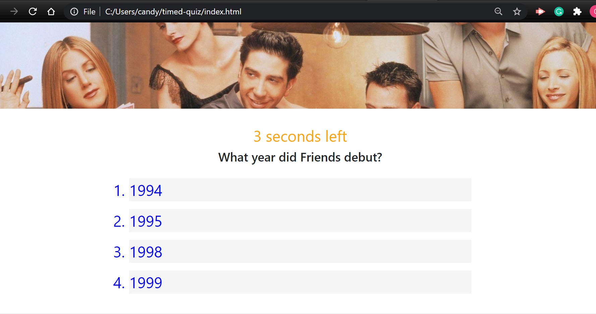

# timed-quiz
Homework #4- 

* First I wrote the HTML with the help of YouTube and W3 schools website. 

* I made my site to be responsive to any user that is using it on any screen size from small to large. 

*

* The second phase was to write the JS file. I kept missing variables and worked on getting them to propperly allign with the rest of the code so that the functions would work properly.

*

Link to the website app:  https://candygarcia014.github.io/friends-trivia-quiz/

Link to the Github Repo: https://github.com/candygarcia014/friends-trivia-quiz

* screenshot of my deployed application: 

Questions for John: 
1. how do I get the timer to stay positve oabove 0 
2. How do I center or shrink the initials box at the end of game?
3. How do I get the log of the winners/high scores? 